# 백트래킹 알고리즘이란
**Backtracking(백트래킹 or 퇴각검색)** 은 다양한 옵션을 점진적으로 시도 하고
 막다른 골목에 이르면 해당 옵션을 취소한 후
 이전 상태로 돌아간 후 다른 옵션으로 다시 시도하는 문제 해결 알고리즘입니다.


## DFS vs Backtracking vs Dynamic Programming 
**DFS는** 트리나 그래프의 깊은 부분을 우선으로 탐색하는 알고리즘이다. 
주로 모든 노드를 순회할 때 사용한다.

DFS를 기반으로 백트래킹과 DP를 구현할 수 있습니다.

**백트래킹은** 제약조건을 만족하지 못하거나 더이상 탐색할 후보가 없으면 이전 단계로 거슬러 올라갑니다.
 DFS와는 달리 모든 경로를 탐색하지 않고 조기에 종료할 수 있어 효율적입니다.
 그래프 노드에서 분기 계수 b와 지름 h가 있는 경우, 노드를 방문하는 각 단계에서 모든 인접 이웃 노드를 저장하면 메모리 요구량은 big-O(bh)가 됩니다.
 그러나 한번에 하나의 이웃 노드만 가져와서 확장하면 메모리 복잡성이 big-O(h)로 줄어듭니다. 전자는 DFS이고 후자는 백트래킹입니다.
 주로 문제에 대해 제약조건을 위반하지 않는 모든 솔루션을 얻기 위해 사용됩니다.

**다이나믹 프로그래밍은** DFS에 메모이제이션 기법을 사용하는 알고리즘입니다. 이미 계산된 값을 다음 계산에 사용하여 다시 계산하는 것을
피할 수 있습니다. DP는 여러가지 솔루션을 찾지 않고 최대값과 같은 하나의 최적의 해를 구하는 알고리즘입니다.

## 수도코드

``` 
function FIND_SOLUTIONS(parameters):
    if(valid solution)
        ACCEPT(solution)
        return
    
    for (choice : choices):
        if(valid choice):   
            ACCEPT(choice) 
            FIND_SOLUTIONS(parameters): 
            BACKTRACK(remove choice)
```

## 연습문제
### 1. [78. Subsets](https://leetcode.com/problems/subsets/description/)

고유한 정수 집합에서 모든 부분집합을 구해야 한다. 결과의 순서는 상관없다.

Input: nums = [1,2,3]

Output: [[], [1], [2], [1,2], [3], [1,3], [2,3], [1,2,3]]
#### 상태공간 트리
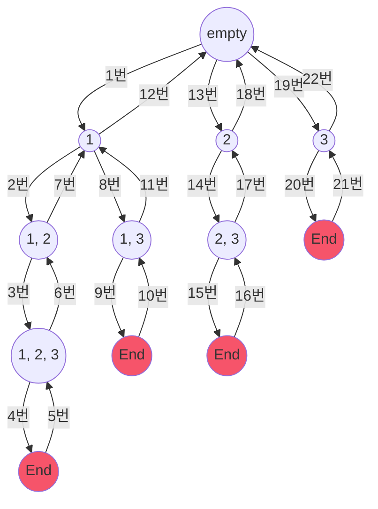
백트래킹은 깊이 우선 탐색을 사용하기 때문에 화살표에 적힌 순서대로 탐색을 한다.

1, 2, 3 이후 더이상 탐색할 후보가 없기 때문에 함수가 종료되고 이전 함수로 돌아간다.

이전 노드에서도 이미 3번을 탐색하였기 때문에 백트래킹하고 함수가 종료된다.

한번 더 이전 노드에서는 2번만 탐색하였기 때문에 3번을 탐색한다. 3번 이후 탐색할 후보가 없기 때문에 함수가 종료된다.

이것을 반복하여 모든 솔루션을 찾는다.

#### 코드
<CodeBlocksWithTabs>
``` java 
class Solution {
    public List<List<Integer>> subsets(int[] nums) {
        List<List<Integer>> list = new ArrayList<>();
        dfs(list, new ArrayList<>(), nums, 0);
        return list;
    }

    private void dfs(List<List<Integer>> list, List<Integer> path, int[] nums, int start) {
        list.add(new ArrayList<>(path));
        for (int i = start; i < nums.length; i++) { 
            path.add(nums[i]); 
            dfs(list, path, nums, i + 1);
            path.remove(path.size() - 1);
        }
    }
}
```

``` kotlin
fun subsets(nums: IntArray): List<List<Int>> {
    val result = ArrayList<List<Int>>()
    val path = ArrayList<Int>()

    fun dfs(start: Int) {
        result.add(path.toList())
        for (i in start until nums.size) {
            path.add(nums[i])
            dfs(i + 1)
            path.removeLast()
        }
    }
    dfs(0)
    return result;
}
```
</CodeBlocksWithTabs>

for문을 통해 nums를 모두 반복하여 가능한 모든 후보를 탐색합니다. 제약조건이 없기 때문에 모든 부분 솔루션이 곧 솔루션이 됩니다.
재귀함수를 통해 더 깊게 탐색을 시도합니다. 이때 이미 탐색한 후보의 다음 후보부터 탐색하기 위해 i + 1을 넘겨줍니다. 
for문을 실행할 수 없는, 즉 후보가 없는 경우 함수가 종료됩니다.

path는 현재 함수의 솔루션을 추적하는데 사용합니다. path에 값이 추가되면 솔루션 또는 부분 솔루션이 되며 이후에 유효성 검사를 통해 결과값에 추가됩니다.
path 마지막에 추가된 값이 삭제되면 솔루션을 추가하기 이전 상태로 되돌아갑니다. 이것이 백트래킹의 주요 구현입니다.

path는 기술적으로 하나의 레퍼런스를 모든 재귀함수에서 사용하기 때문에 static 변수로 생각하면 편합니다.

### 2. [90. Subsets II](https://leetcode.com/problems/subsets-ii/description/)
위 subsets 문제에서 인풋인 정수배열에 중복 숫자가 허용된 문제입니다.

아웃풋 집합에서 중복된 부분 집합은 포함하지 않아야 합니다.

Input: nums = [1,2,2]

Output: [[ ], [1], [1,2], [1,2,2], [2], [2,2]]

#### 상태공간 트리 
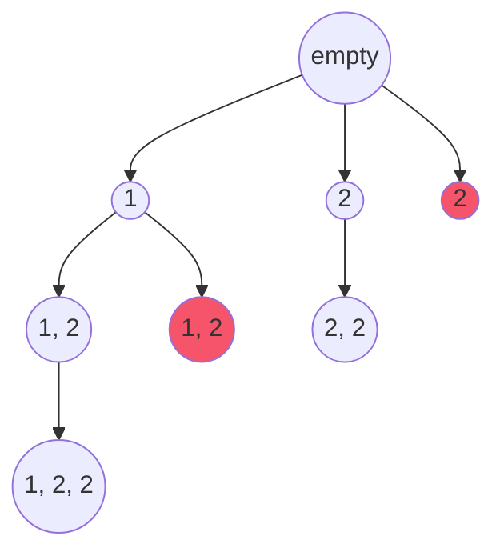
subset과 같은 방식으로 문제를 풀게되면 위와같이 중복된 집합이 포함된 솔루션을 반환하게 됩니다.

Output: [[ ], [1], [1,2], [1,2,2], [1, 2], [2], [2,2], [2]]

중복을 제거하기 위해서 다음 후보를 가져올 때 이전 후보와 같은지를 확인해야합니다.

nums[i]를 확인했더니 2인 경우 num[i - 1]도 2였다면 더 이상 진행하면 안됩니다.

nums[i - 1]이 배열의 범위를 벗어나는 것을 방지하기 위해 i > start를 추가해줍니다.

```java {2}
for (int i = start; i < nums.length; i++) {
    if (i > start && nums[i] == nums[i - 1]) continue;
    path.add(nums[i]);
    dfs(list, path, nums, i + 1);
    path.remove(path.size() - 1);
}
```
또한 매번 이전 값만 비교하기 때문에 올바르게 작동하기 위해 인풋 배열을 정렬해야만 합니다.

``` java {3} 
public List<List<Integer>> subsetsWithDup(int[] nums) {
    List<List<Integer>> list = new ArrayList<>();
    Arrays.sort(nums);
    dfs(list, new ArrayList<>(), nums, 0);
    return list;
    }
```

#### 전체코드

<CodeBlocksWithTabs>
``` java 
class Solution {
    public List<List<Integer>> subsetsWithDup(int[] nums) {
        List<List<Integer>> list = new ArrayList<>();
        Arrays.sort(nums);
        dfs(list, new ArrayList<>(), nums, 0);
        return list;
    }

    private void dfs(List<List<Integer>> list, List<Integer> path, int[] nums, int start) {
        list.add(new ArrayList<>(path));
        for (int i = start; i < nums.length; i++) {
            if (i > start && nums[i] == nums[i - 1]) continue;
            path.add(nums[i]);
            dfs(list, path, nums, i + 1);
            path.remove(path.size() - 1);

        }
    }
}
```

``` kotlin
fun subsetsWithDup(nums: IntArray): List<List<Int>> {
    nums.sort()
    val result = ArrayList<List<Int>>()
    val path = ArrayList<Int>()

    fun dfs(start: Int) {
        result.add(path.toList())
        for (i in start until nums.size) {
            if (i > start && nums[i] == nums[i - 1]) continue
            path.add(nums[i])
            dfs(i + 1)
            path.removeLast()
        }
    }
    dfs(0)
    return result;
}
```
</CodeBlocksWithTabs>

### 3. [46. Permutations](https://leetcode.com/problems/permutations/description/)
정수배열이 주어지면 가능한 모든 순열을 반환한다.

Input: nums = [1,2,3]

Output: [[1,2,3], [1,3,2], [2,1,3], [2,3,1], [3,1,2], [3,2,1]]

#### 상태공간 트리
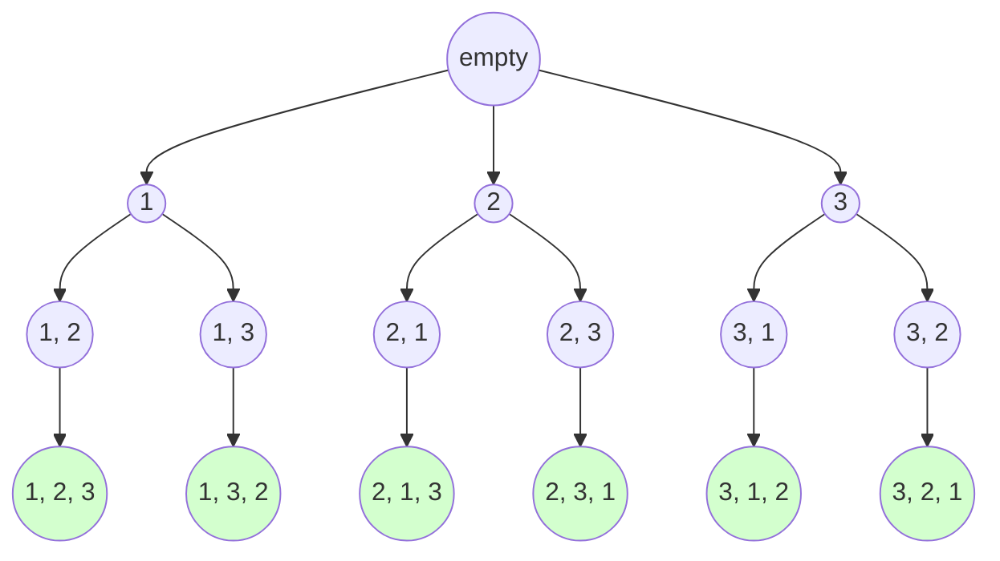

모든 솔루션은 인풋 배열인 nums의 길이와 같다.

매 재귀함수에서 후보를 탐색할 때 nums를 모두 순회해야만 최종적으로 올바른 솔루션에 도달할 수 있다.
이 때 이미 사용한 값은 생략해야만 한다. 불리언 배열 used를 통해 이미 사용한 값을 체크해둘 수 있다.

``` java {1,7,8,10,11}
private void dfs(List<List<Integer>> list, List<Integer> path, int[] nums, boolean[] used) {
    if (path.size() == nums.length) {
        list.add(new ArrayList<>(path));
        return;
    }
    for (int i = 0; i < nums.length; i++) {
        if (used[i]) continue;
        used[i] = true;
        path.add(nums[i]);
        dfs(list, path, nums, used);
        used[i] = false;
        path.remove(path.size() - 1);
    }
}

```

또한 점진적으로 부분 솔루션을 구성하다가 path의 길이가 nums의 길이와 같을때만 결과 배열에 추가할 수 있다.

``` java {2-5}
private void dfs(List<List<Integer>> list, List<Integer> path, int[] nums, boolean[] used) {
    if (path.size() == nums.length) {
        list.add(new ArrayList<>(path));
        return;
    }
    ...생략
}
```

전체 코드는 아래와 같다.

#### 코드
<CodeBlocksWithTabs>
```java
class Solution {
    public List<List<Integer>> permute(int[] nums) {
        List<List<Integer>> list = new ArrayList<>();
        Arrays.sort(nums);
        dfs(list, new ArrayList<>(), nums, new boolean[nums.length]);
        return list;
    }

    private void dfs(List<List<Integer>> list, List<Integer> path, int[] nums, boolean[] used) {
        if (path.size() == nums.length) {
            list.add(new ArrayList<>(path));
            return;
        }
        for (int i = 0; i < nums.length; i++) {
            if (used[i]) continue;
            used[i] = true;
            path.add(nums[i]);
            dfs(list, path, nums, used);
            used[i] = false;
            path.remove(path.size() - 1);
        }
    }
}
```

``` kotlin
fun permute(nums: IntArray): List<List<Int>> {
    val result = ArrayList<List<Int>>()
    val path = ArrayList<Int>()
    val visited = BooleanArray(nums.size)
    fun dfs() {
        if (path.size == nums.size) {
            result.add(path.toList())
        }
        for (index in nums.indices) {
            if (visited[index]) continue
            path.add(nums[index])
            visited[index] = true
            dfs()
            visited[index] = false
            path.removeLast()
        }
    }
    dfs()
    return result;
}
```
</CodeBlocksWithTabs>

### 4. [47. Permutations II](https://leetcode.com/problems/permutations-ii/description/)
중복된 숫자가 포함된 정수 배열의 가능한 모든 순열을 반환한다.

중복된 순열은 아웃풋에 포함될 수 없다.

Input: nums = [1,1,2]
Output: [[1,1,2], [1,2,1], [2,1,1]]

#### 상태공간 트리
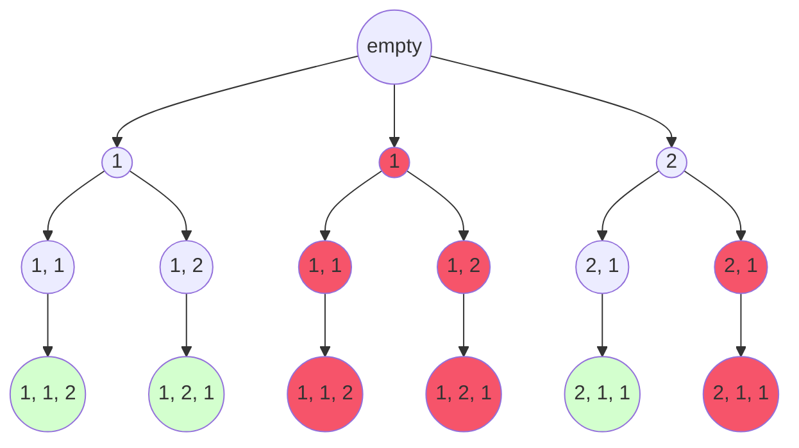

permutations의 코드를 그대로 사용하게되면 위 트리와 같은 중복된 솔루션이 포함된다.

후보를 고를 때 nums[i]와 nums[i - 1]을 비교하여 값이 같으면 생략하는 방식으로 중복을 제거할 수 있다.

다만 i - 1이 배열의 범위를 넘어서는 것을 방지하기 위해 i > 0을 추가해야만 한다.

또한 DFS에서 깊은 노드로 탐색된 후 부모 노드로 돌아왔을 경우에만 중복을 제거해야 하기 때문에 used[i - 1]이 false일 경우에만 탐색을 생략해야만 한다.

``` java {5}
private void dfs(List<List<Integer>> list, List<Integer> path, int[] nums, boolean[] used) {
    ...생략
    for (int i = 0; i < nums.length; i++) {
        if(used[i]) continue;
        if(i > 0 && nums[i] == nums[i-1] && !used[i - 1]) continue;
        used[i] = true;
        path.add(nums[i]);
        dfs(list, path, nums, used);
        path.remove(path.size() - 1);
        used[i] = false;
    }
}
```
nums[i]와 nums[i - 1]을 비교할때 배열이 정렬되어 있음을 가정하기 때문에 인풋 배열을 정렬해야만 한다.

``` java {3}
public List<List<Integer>> permute(int[] nums) {
    List<List<Integer>> list = new ArrayList<>();
    Arrays.sort(nums);
    dfs(list, new ArrayList<>(), nums, new boolean[nums.length]);
    return list;
}
```

위와 같은 코드를 추가하고 필요없는 리프노드를 가지치기하면 아래와 같은 상태공간 트리가 생성된다.

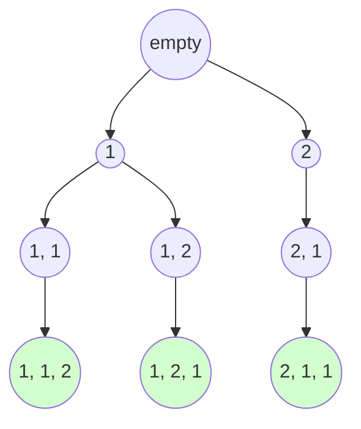

#### 전체코드
<CodeBlocksWithTabs>
```java
class Solution {
    public List<List<Integer>> permute(int[] nums) {
        List<List<Integer>> list = new ArrayList<>();
        Arrays.sort(nums);
        dfs(list, new ArrayList<>(), nums, new boolean[nums.length]);
        return list;
    }

    private void dfs(List<List<Integer>> list, List<Integer> path, int[] nums, boolean[] used) {
        if (path.size() == nums.length) {
            list.add(new ArrayList<>(path));
            return;
        }
        for (int i = 0; i < nums.length; i++) {
            if(used[i]) continue;
            if(i > 0 && nums[i] == nums[i-1] && !used[i - 1]) continue;
            used[i] = true;
            path.add(nums[i]);
            dfs(list, path, nums, used);
            path.remove(path.size() - 1);
            used[i] = false;
        }
    }
}
```
``` kotlin
fun permuteUnique(nums: IntArray): List<List<Int>> {
    nums.sort()
    val result = ArrayList<List<Int>>()
    val path = ArrayList<Int>()
    val visited = BooleanArray(nums.size)
    fun dfs() {
        if (path.size == nums.size) {
            result.add(path.toList())
        }
        for (index in nums.indices) {
            if (visited[index]) continue
            if (index > 0 && nums[index] == nums[index - 1] && !visited[index - 1]) continue;
            path.add(nums[index])
            visited[index] = true
            dfs()
            visited[index] = false
            path.removeLast()
        }
    }
    dfs()
    return result;
}
```
</CodeBlocksWithTabs>
### 5. [39. Combination Sum](https://leetcode.com/problems/combination-sum/description/)
인풋으로 고유한 정수 배열 candidates와 target 정수가 있을 때, 모두 합산하여 target이 되는 모든 정수 집합을 구합니다.

같은 숫자를 여러번 사용할 수 있습니다. 빈도가 같을 경우 같은 집합으로 여깁니다. ([2, 2, 3] [2, 3, 2]는 같다.)

Input: candidates = [2, 3, 6, 7], target = 7

Output: [[2, 2, 3], [7]]

#### 상태공간 트리
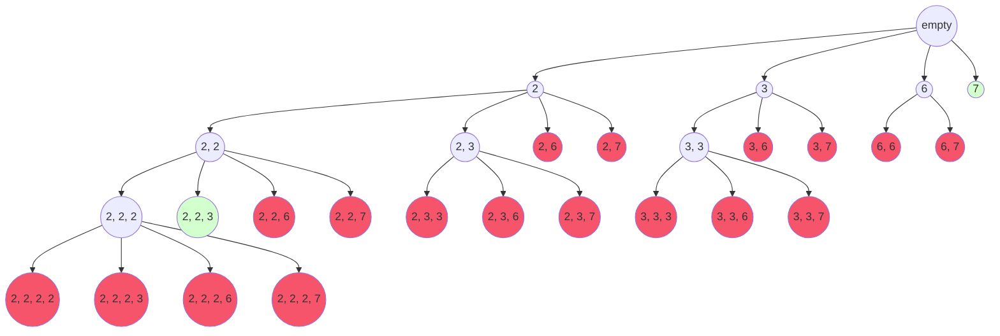

탐색할 때 중요한 포인트는 같은 수를 여러 번 사용할 수 있다는 점과 순서에 상관없이 같은 빈도의 요소를 가진 집합은 같은 것으로 간주합니다.

``` java {3}
for (int i = start; i < nums.length; i++) {
    path.add(nums[i]);
    dfs(list, path, nums, remain - nums[i], i);
    path.remove(path.size() - 1);
}
```

for문으로 트리의 하위 노드를 탐색할 때 i를 dfs의 인자로 넘겨주면 하위 노드에서 현재 인덱스부터 탐색하기 때문에 [2, 2, 2, 2]와 같은 중복 값으로 솔루션을 구성할 수 있게 된다.
만약 i + 1로 하게 될 경우 같은 수를 다시는 탐색하지 않는다.

또한 for문의 i 초기화를 start로 하지 않고 0으로 하게되면 매 하위 노드에서 모든 값을 다시 탐색하기 때문에 [2, 2, 3], [2, 3, 2], [3, 2, 2]와 같은 빈도의 중복된 집합을 솔루션에 포함하게 된다. 

솔루션의 제약 조건으로 솔루션 집합의 모든 정수를 합할 경우 target 정수와 같은 값이 되어야만 합니다.
만약 합하였을 때 target보다 클 경우 더 이상 깊게 탐색할 필요가 없습니다.

``` java
if (remain < 0) return;
if (remain == 0) {
    list.add(new ArrayList<>(path));
    return;
}
```

#### 전체코드
<CodeBlocksWithTabs>
```java {10-14, 16, 18}
class Solution {
    public List<List<Integer>> combinationSum(int[] candidates, int target) {
        List<List<Integer>> result = new ArrayList<>();
        dfs(result, new ArrayList<>(), candidates, target, 0);
        return result;
    }

    private void dfs(List<List<Integer>> list, ArrayList<Integer> path,
                    int[] nums, int remain, int start) {
        if (remain < 0) return;
        if (remain == 0) {
            list.add(new ArrayList<>(path));
            return;
        }

        for (int i = start; i < nums.length; i++) {
            path.add(nums[i]);
            dfs(list, path, nums, remain - nums[i], i);
            path.remove(path.size() - 1);
        }
    }
}
```
``` kotlin
fun combinationSum(candidates: IntArray, target: Int): List<List<Int>> {
    val result = ArrayList<List<Int>>()
    val path = ArrayList<Int>()

    fun dfs(target: Int, start: Int) {
        if (target == 0) {
            result.add(path.toList())
        }
        for (index in start until candidates.size) {
            if (target < candidates[index]) continue
            path.add(candidates[index])
            dfs(target - candidates[index], index)
            path.removeLast()
        }
    }
    dfs(target, 0)
    return result;
}
```
</CodeBlocksWithTabs>

### 6. [40. Combination Sum II](https://leetcode.com/problems/combination-sum-ii/description/)

Combination Sum 문제와 내용이 같지만 같은 숫자를 여러번 사용할 수 없습니다.

또한 인풋 배열에 같은 정수가 여러 번 존재할 수 있습니다.

``` java {1, 4}
for (int i = start; i < nums.length; i++) {
    if (i > start && nums[i] == nums[i - 1]) continue;
    path.add(nums[i]);
    dfs(list, path, nums, remain - nums[i], i + 1);
    path.remove(path.size() - 1);
}
```
같은 숫자를 여러번 사용하지 않기 때문에 하위 노드로 이동할 때 i가 아니라 i + 1을 넘겨주어 다음 인덱스의 값을 가져오도록 한다.

그리고 인풋 배열에 같은 숫자가 여러 개 있을 수 있기 때문에 인풋 배열을 우선 정렬해야만 한다.

``` java {3}
public List<List<Integer>> combinationSum2(int[] candidates, int target) {
    List<List<Integer>> result = new ArrayList<>();
    Arrays.sort(candidates);
    dfs(result, new ArrayList<>(), candidates, target, 0);
    return result;
}
```

이후 매번 이전 값과 같은지 확인하여 같은 숫자는 생략하도록 구현한다.

``` java {2}
for (int i = start; i < nums.length; i++) {
    if (i > start && nums[i] == nums[i - 1]) continue;
    path.add(nums[i]);
    dfs(list, path, nums, remain - nums[i], i + 1);
    path.remove(path.size() - 1);
}
```

#### 전체코드
<CodeBlocksWithTabs>
```java
class Solution {
    public List<List<Integer>> combinationSum2(int[] candidates, int target) {
        List<List<Integer>> result = new ArrayList<>();
        Arrays.sort(candidates);
        dfs(result, new ArrayList<>(), candidates, target, 0);
        return result;
    }

    private void dfs(List<List<Integer>> list, ArrayList<Integer> path,
                     int[] nums, int remain, int start) {
        if (remain < 0) return;
        if (remain == 0) {
            list.add(new ArrayList<>(path));
            return;
        }
        for (int i = start; i < nums.length; i++) {
            if (i > start && nums[i] == nums[i - 1]) continue;
            path.add(nums[i]);
            dfs(list, path, nums, remain - nums[i], i + 1);
            path.remove(path.size() - 1);
        }
    }
}
```
``` kotlin
fun combinationSum2(candidates: IntArray, target: Int): List<List<Int>> {
    candidates.sort()
    val result = ArrayList<List<Int>>()
    val path = ArrayList<Int>()

    fun dfs(target: Int, start: Int) {
        if (target == 0) {
            result.add(path.toList())
        }
        for (index in start until candidates.size) {
            if (target < candidates[index]) continue
            if (index > start && candidates[index] == candidates[index - 1]) continue
            path.add(candidates[index])
            dfs(target - candidates[index], index + 1)
            path.removeLast()
        }
    }
    dfs(target, 0)
    return result;
}
```
</CodeBlocksWithTabs>

### 7. [131. Palindrome Partitioning](https://leetcode.com/problems/palindrome-partitioning/description/)
문자열 s가 주어졌을 때, 모든 하위 문자열이 팰린드롬일 경우를 찾아라.

이러한 경우를 가능한 모두 반환하라.

Input: s = "aabb"

Output: [["a", "a", "b", "b"], ["a", "a", "bb"], ["aa", "b", "b"], ["aa", "bb"]]

#### 상태공간 트리
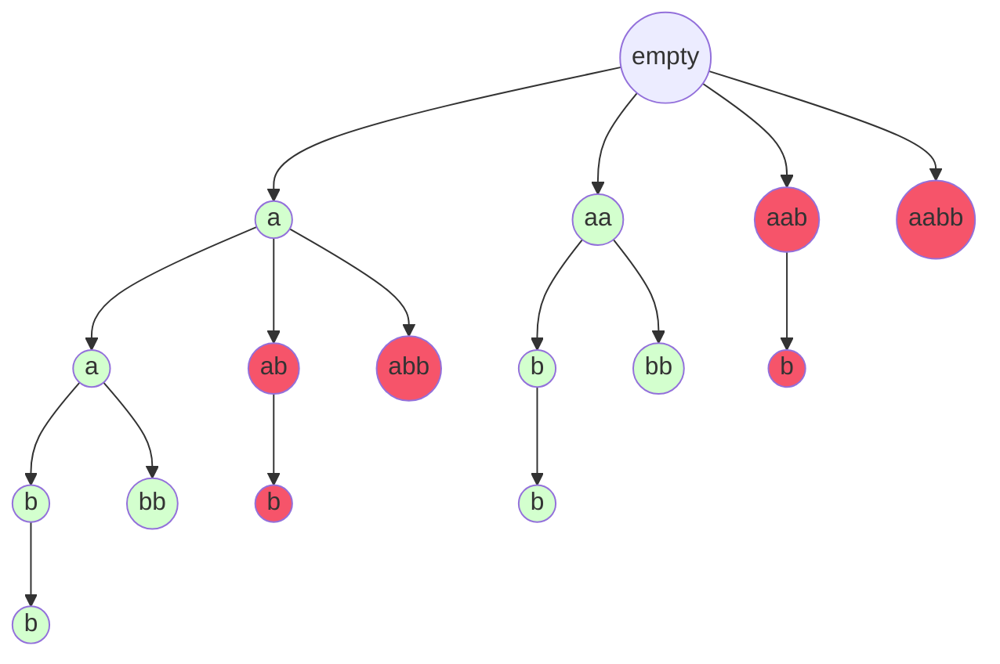

문제 해결을 위해서는 첫째로 가능한 모든 하위 문자열을 순회해야한다. 모든 하위 문자열은 같은 문자를 중복해서 사용하지 않고 한번씩 사용해야 한다.


``` java
public void dfs(List<List<String>> list, List<String> path, String s, int start) {
    if (start == s.length()) {
        list.add(new ArrayList<>(path));
        return;
    }
    for (int i = start; i < s.length(); i++) {
        path.add(String.valueOf(s.charAt(i)));
        dfs(list, path, s, i + 1);
        path.remove(path.size() - 1);
    }
}
```
위 코드를 abcd를 통해 순회하면 아래와 같은 상태공간트리가 생성된다.

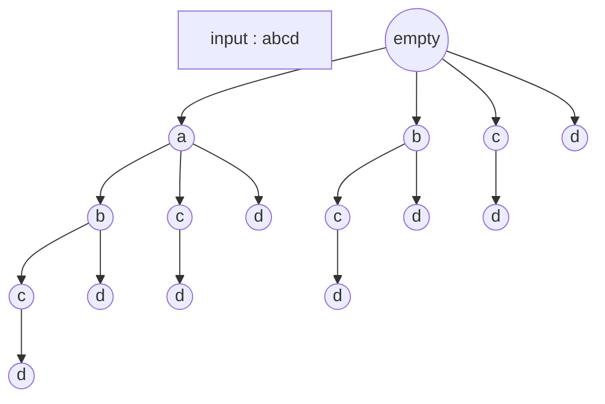
트리의 깊이가 하위 문자열의 총 길이이다. 하위 문자열을 추가할 때 부족한 문자만큼 추가해준다.

``` java {7}
public void dfs(List<List<String>> list, List<String> path, String s, int start) {
    if (start == s.length()) {
        list.add(new ArrayList<>(path));
        return;
    }
    for (int i = start; i < s.length(); i++) {
        path.add(s.substring(start, i + 1));
        dfs(list, path, s, i + 1);
        path.remove(path.size() - 1);
    }
}
```

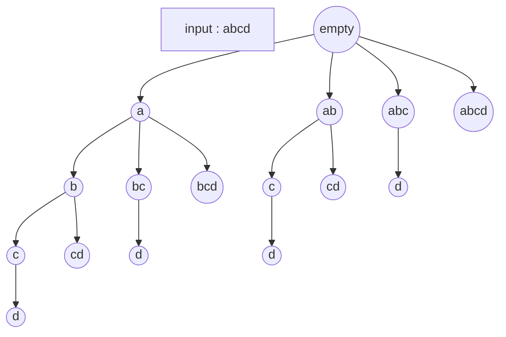

이렇게 모든 하위 문자열을 찾을 수 있다.

두번째로 하위 문자열이 모두 팰린드롬인지 확인해야 한다.
팰린드롬이 아닐 경우 해당 솔루션은 폐기하고 다음으로 진행한다.


#### 코드
```java {7,11, 15-22}
public void dfs(List<List<String>> list, List<String> path, String s, int start) {
    if (start == s.length()) {
        list.add(new ArrayList<>(path));
        return;
    }
    for (int i = start; i < s.length(); i++) {
        if (isPalindrome(s, start, i)) {
            path.add(s.substring(start, i + 1));
            dfs(list, path, s, i + 1);
            path.remove(path.size() - 1);
        }
    }
}
    
public boolean isPalindrome(String s, int low, int high) {
    while (low < high) {
        if (s.charAt(low++) != s.charAt(high--)) {
            return false;
        }
    }
    return true;
}
```

#### 전체코드
<CodeBlocksWithTabs>
``` java
class Solution {
    public List<List<String>> partition(String s) {
        List<List<String>> list = new ArrayList<>();
        dfs(list, new ArrayList<>(), s, 0);
        return list;
    }
    
    public void dfs(List<List<String>> list, List<String> path, String s, int start) {
        if (start == s.length()) {
            list.add(new ArrayList<>(path));
            return;
        }
        for (int i = start; i < s.length(); i++) {
            if (isPalindrome(s, start, i)) {
                path.add(s.substring(start, i + 1));
                dfs(list, path, s, i + 1);
                path.remove(path.size() - 1);
            }
        }
    }
    
    public boolean isPalindrome(String s, int low, int high) {
        while (low < high) {
            if (s.charAt(low++) != s.charAt(high--)) {
                return false;
            }
        }
        return true;
    }
}
```
``` kotlin
fun partition(s: String): List<List<String>> {
    val result = ArrayList<List<String>>()
    val path = ArrayList<String>()

    fun dfs(start: Int) {
        if (start >= s.length) {
            result.add(path.toList())
        }
        for (index in start until s.length) {
            val sliced = s.slice(IntRange(start, index))
            if (!isPalindrome(sliced)) continue
            path.add(sliced)
            dfs(index + 1)
            path.removeLast()
        }
    }
    dfs(0)

    return result
}

private fun isPalindrome(s: String): Boolean {
    var a = 0
    var b: Int = s.length - 1
    while (a < b) {
        if (s[a++] != s[b--]) {
            return false;
        }
    }
    return true;
}
```
</CodeBlocksWithTabs>

### 8. [79. Word Search](https://leetcode.com/problems/word-search/description/)
주어진 2D배열에 주어진 단어가 존재하면 true, 아니면 false이다.
단어는 수평 수직으로 인접한 문자를 연속적으로 합하여 만들 수 있다.


Input: board = [["A","B","C","E"], ["S","F","C","S"], ["A","D","E","E"]]

word = "ABCCED"

Output: true

#### 접근방식
단어를 확인하기 위해서는 단어의 모든 문자가 연속적으로 존재하는지 확인해야 한다. 따라서 DFS 방식으로 탐색을 해야 한다.

중간에 단어와 다른 문자가 발견될 경우 더이상 탐색할 필요가 없기 때문에 이전으로 되돌아가 (백트래킹) 다른 방향으로 탐색한다.

#### 전체코드
<CodeBlocksWithTabs>
```java
public class SearchWord {
    
    public boolean exist(char[][] board, String word) {
        boolean[][] visited = new boolean[board.length][board[0].length];
        
        for (int i = 0; i < board.length; i++) {
            for (int j = 0; j < board[i].length; j++) {
                if ((word.charAt(0) == board[i][j]) && dfs(board, word, visited, i, j, 0)) {
                    return true;
                }
            }
        }
        return false;
    }
    
    private boolean dfs(char[][] board, String word, boolean[][] visited, int i, int j, int index) {
        if (index == word.length()) {
            return true;
        }
        
        if (isValidCoordinate(board, i, j) || board[i][j] != word.charAt(index) || visited[i][j]) {
            return false;
        }
        
        visited[i][j] = true;
        if (dfs(board, word, visited, i - 1, j, index + 1) ||
                dfs(board, word, visited, i + 1, j, index + 1) ||
                dfs(board, word, visited, i, j - 1, index + 1) ||
                dfs(board, word, visited, i, j + 1, index + 1)) {
            return true;
        }
        visited[i][j] = false;
        return false;
    }
    
    private boolean isValidCoordinate(char[][] board, int i, int j) {
        return i >= board.length || i < 0 || j >= board[i].length || j < 0;
    }
```
``` kotlin
fun exist(board: Array<CharArray>, word: String): Boolean {


}
```
</CodeBlocksWithTabs>
### 9. [17. Letter Combinations of a Phone Number](https://leetcode.com/problems/letter-combinations-of-a-phone-number/description/)

주어진 문자열 digit의 각 문자에 맞는 전화기 번호 버튼을 눌렀을 때 나올 수 있는 문자의 모든 조합을 구하라.

Input: digits = "23"

Output: ["ad","ae","af","bd","be","bf","cd","ce","cf"]

#### 상태공간 트리
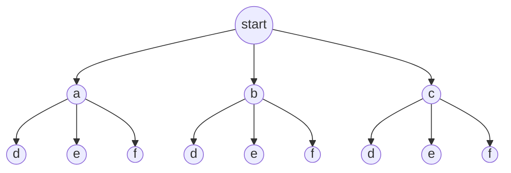

우선 전화기 버튼을 눌렀을 때 어떤 문자열을 가지고 있는지 알 수 있어야 한다.

``` java
String[] digitToLetterMap = new String[]{"", "", "abc", "def", "ghi", "jkl", "mno", "pqrs", "tuv", "wxyz"};
```

DFS를 통해 가능한 모든 조합을 탐색한다. 

combination이 digis의 길이와 같아지면 조합을 찾았기 때문에 정답 리스트에 추가한다.


``` java 
public void dfs(List<String> result, String[] digitToLetterMap, char[] digits, String combination ) {
    if (combination.length() == digits.length) {
        result.add(combination);
        return;
    }

    int i = combination.length();
    int digit = Character.getNumericValue(digits[i]);
    for (char letter : digitToLetterMap[digit].toCharArray()) {
        dfs(result,  digitToLetterMap, digits, combination + letter);
    }
}
```

#### 전체 코드
<CodeBlocksWithTabs>
``` java
class Solution {
    public List<String> letterCombinations(String digits) {
        if (digits.isEmpty()) {
            return new ArrayList<>();
        }
        
        String[] digitToLetterMap = new String[]{"", "", "abc", "def", "ghi", "jkl", "mno", "pqrs", "tuv", "wxyz"};
        List<String> result = new ArrayList<>();
        dfs(result, digitToLetterMap, digits.toCharArray(), "");
        return result;
    }
    
    public void dfs(List<String> result, String[] digitToLetterMap, char[] digits, String combination ) {
        if (combination.length() == digits.length) {
            result.add(combination);
            return;
        }

        int i = combination.length();
        int digit = Character.getNumericValue(digits[i]);
        for (char letter : digitToLetterMap[digit].toCharArray()) {
            dfs(result,  digitToLetterMap, digits, combination + letter);
        }
    }
}

```
``` kotlin
todo
```
</CodeBlocksWithTabs>

### 10. [51. N-Queens](https://leetcode.com/problems/n-queens/description/)
#### 코드
```java

```
#### 상태공간 트리
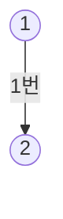


참고자료
- https://codeiiest-dev.github.io/Algorithms/Backtracking/Pseudocode/Pseudocode.html
- https://www.geeksforgeeks.org/introduction-to-backtracking-data-structure-and-algorithm-tutorials/
- https://leetcode.com/problems/subsets/solutions/27281/a-general-approach-to-backtracking-questions-in-java-subsets-permutations-combination-sum-palindrome-partitioning/
- https://stackoverflow.com/questions/1294720/whats-the-difference-between-backtracking-and-depth-first-search